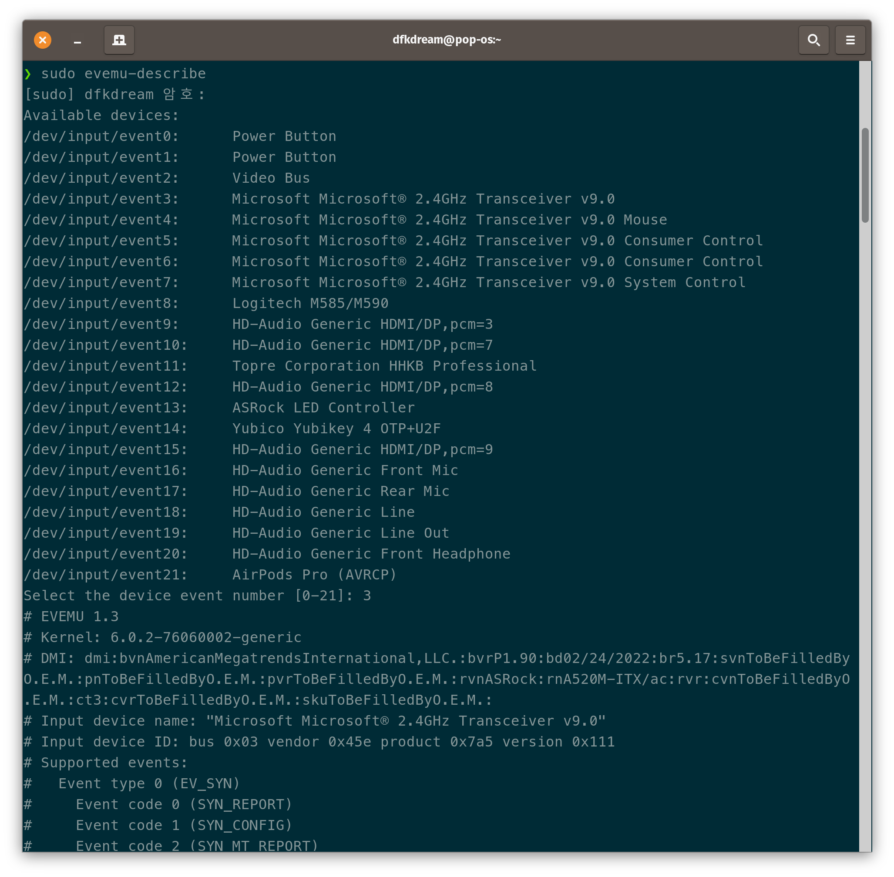
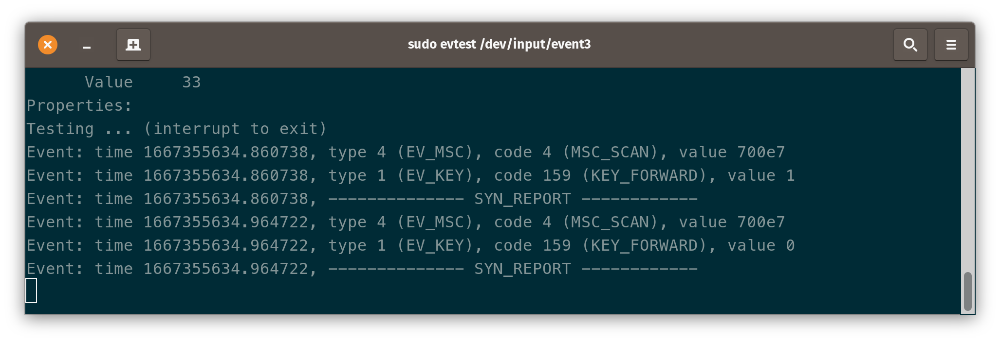
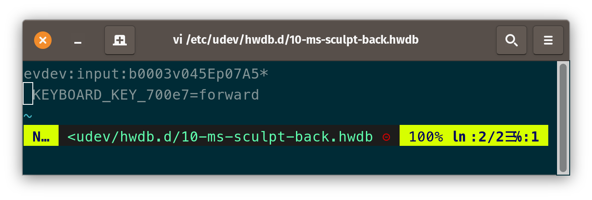

얼마 전에 MS Sculpt Ergonomic 마우스를 구입했고, 정말 잘 사용하고 있습니다. 하지만 이 마우스는 특이하게 앞으로 가기 버튼이 없고 Windows 키가 기본으로 할당되어 있습니다. 리눅스에서 이 키를 매핑할 수 있는 유틸리티가 제공되지 않아 다른 방법을 찾아 보았습니다.

# 테스트 환경
* Pop! OS 22.04 LTS (Ubuntu 22.04)

# 설치해야 하는 패키지
- `evemu-test`
- `evtest`

# 마우스 정보 확인
```
sudo evemu describe
```

`bus`, `vendor`, `product` 정보를 확인할 수 있습니다.

이 마우스의 경우 bus는 `0x03`, vendor는 `0x45e`, product는 `0x7a5`입니다.

hwdb 파일 작성에 필요하니 기록해 둡시다.

특이하게도 MS Sculpt Ergonomic 마우스는 포인터 정보와 윈도우 버튼 정보를 다른 디바이스에서 전송합니다. 포인터 정보는 `event4`, 윈도우 버튼 정보는 `event3`.

디바이스 파일 경로는 `evtest` 실행에 필요하니 기록해 둡시다.



# Scancode 정보 확인
```
sudo evtest <디바이스 경로>
```
디바이스 경로는 [마우스 정보 확인](#마우스-정보-확인)에서 찾을 수 있습니다.

리매핑할 키를 여러번 누르고 `(MSC_SCAN)` 뒤의 value 를 확인합니다.


이 마우스에서 윈도우 키의 스캔코드는 `700e7`입니다.
# hwdb 파일 작성
```
sudo vi /etc/udev/hwdb.d/10-ms-sculpt-remap.hwdb
```

첫 줄의 `evdev:input:b<bus>v<vendor>p<product>*` 로 장치 필터를 설정합니다.

bus, vendor, product 값은 대문자 4자리 Hex 코드로 입력합니다.

`KEYBOARD_KEY_<scancode>=<keycode>` 로 스캔코드에 리매핑할 키를 지정합니다.

scancode는 소문자 Hex 코드로 입력합니다.

keycode는 `/usr/include/linux/input-event-codes.h` 파일에서 확인할 수 있습니다.

`#define KEY_` 뒤의 문자열을 소문자로 입력해 줍니다.

